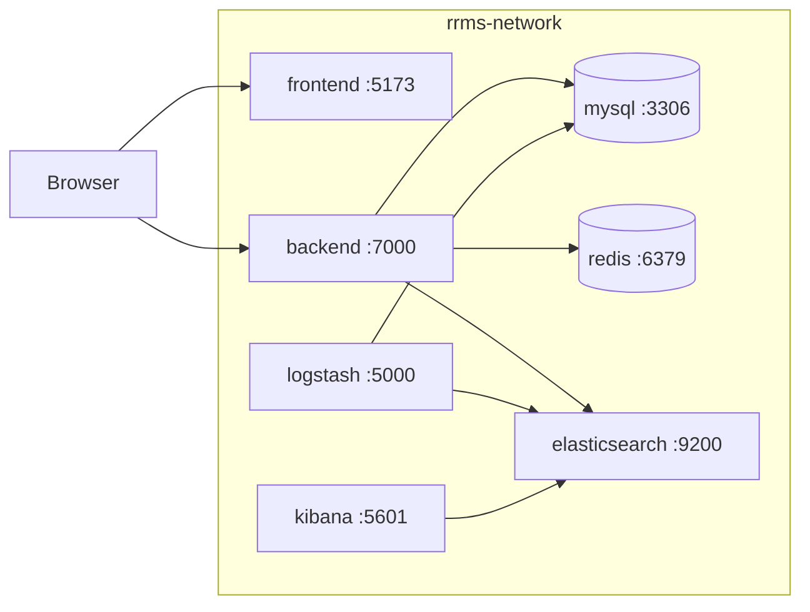

# Docker Compose — RRMS

Hướng dẫn chạy toàn bộ hệ thống RRMS bằng **một file cấu hình duy nhất** (`docker-compose.yml`).

## Tại sao dùng Docker Compose?

| Không có Compose | Có Compose |
|---|---|
| Chạy thủ công từng container | **1 lệnh** chạy tất cả |
| Tự cấu hình network giữa các container | **Tự động kết nối** qua tên service (`mysql`, `redis`, `backend`...) |
| Khó chia sẻ môi trường cho teammate | Commit `.env.example` lên Git, mọi người copy thành `.env` |
| "Máy tôi chạy được, máy anh không" | **Môi trường đồng nhất** trên mọi máy có Docker |

## Kiến trúc



## Yêu cầu

- [Docker Desktop](https://www.docker.com/products/docker-desktop/) (Windows/macOS) hoặc Docker Engine + Compose (Linux)
- RAM khuyến nghị: **8 GB+** (Elasticsearch cần ~512 MB–1 GB)

## Thiết lập nhanh

### 1. Tạo file môi trường

```bash
# Từ thư mục gốc RRMS/
cp .env.example .env
```

Chỉnh `DB_PASSWORD`, `REDIS_PASSWORD`, `JWT_SIGNER` và các API key trong `.env`.  
**Không commit** file `.env` lên Git.

### 2. Chuẩn bị phụ thuộc Logstash

```powershell
# Windows
.\scripts\prepare-docker.ps1
```

```bash
# Linux / macOS
chmod +x scripts/prepare-docker.sh
./scripts/prepare-docker.sh
```

Script tải/copy `mysql-connector-j-8.3.0.jar` vào `server/logstash/lib/`.

### 3. Chạy toàn bộ stack

```bash
docker compose up -d --build
```

### 4. Kiểm tra

| Dịch vụ | URL |
|---|---|
| Frontend | http://localhost:5173 |
| Backend API | http://localhost:7000 |
| Swagger | http://localhost:7000/swagger-ui/index.html |
| Kibana | http://localhost:5601 |
| Elasticsearch | http://localhost:9200 |

```bash
docker compose ps
docker compose logs -f backend
```

## Các chế độ chạy

### Chạy toàn bộ (CI, demo, staging local)

```bash
docker compose up -d --build
```

### Chỉ hạ tầng — dev với IDE (khuyên dùng khi code)

Chạy MySQL + Redis trong Docker, backend/frontend chạy trực tiếp trên máy:

```bash
docker compose up -d mysql redis
```

Sau đó:

```bash
# Backend (trong server/)
.\mvnw.cmd -Dmaven.test.skip=true spring-boot:run

# Frontend (trong client/)
npm run dev
```

File `.env` ở thư mục gốc cũng được `spring-dotenv` đọc khi chạy backend local (qua `application.properties`).

### Chạy hạ tầng + ELK (không build app)

```bash
docker compose up -d mysql redis elasticsearch kibana logstash
```

## Tên service và kết nối mạng

Trong Docker network `rrms-network`, các container gọi nhau bằng **tên service**:

| Biến môi trường | Giá trị trong Docker | Giá trị khi dev local |
|---|---|---|
| `SPRING_DATASOURCE_URL` | `jdbc:mysql://mysql:3306/rrms...` | `jdbc:mysql://localhost:3306/rrms...` |
| `REDIS_HOST` | `redis` | `localhost` |
| `ELASTIC_SEARCH_URL` | `http://elasticsearch:9200` | `http://localhost:9200` |
| `VITE_APP_API_URL` | `http://localhost:7000` | `http://localhost:7000` |

> **Lưu ý:** Trình duyệt chạy ngoài Docker nên frontend luôn gọi API qua `localhost`, không dùng tên `backend`.

## Lệnh hữu ích

```bash
# Dừng toàn bộ
docker compose down

# Dừng và xóa volume (reset database)
docker compose down -v

# Build lại một service
docker compose up -d --build backend

# Xem log một service
docker compose logs -f mysql
```

## Chia sẻ với team

1. Commit `docker-compose.yml`, `.env.example`, `Dockerfile`, `docs/DOCKER_COMPOSE.md`
2. Mỗi dev: `cp .env.example .env` và điền secret riêng
3. Chạy `docker compose up -d --build`

Mọi người có cùng phiên bản MySQL, Redis, Elasticsearch và cùng cấu hình network.

## Xử lý sự cố

**Elasticsearch không start (Windows):** tăng RAM Docker Desktop lên 4 GB+, hoặc tạm tắt ELK:

```bash
docker compose up -d mysql redis backend frontend
```

**Port bị chiếm:** đổi port trong `.env` (ví dụ `MYSQL_PORT=3307`, `PORT=7001`).

**Backend lỗi kết nối DB:** đợi MySQL healthy (`docker compose ps`), hoặc xem log:

```bash
docker compose logs mysql backend
```

## File liên quan

```
RRMS/
├── docker-compose.yml      # Định nghĩa toàn bộ stack
├── .env.example            # Mẫu biến môi trường (commit được)
├── .env                    # Secret thật (không commit)
├── client/Dockerfile       # Build React + Nginx
├── server/Dockerfile       # Build Spring Boot JAR
└── scripts/prepare-docker.* # Chuẩn bị JAR cho Logstash
```
