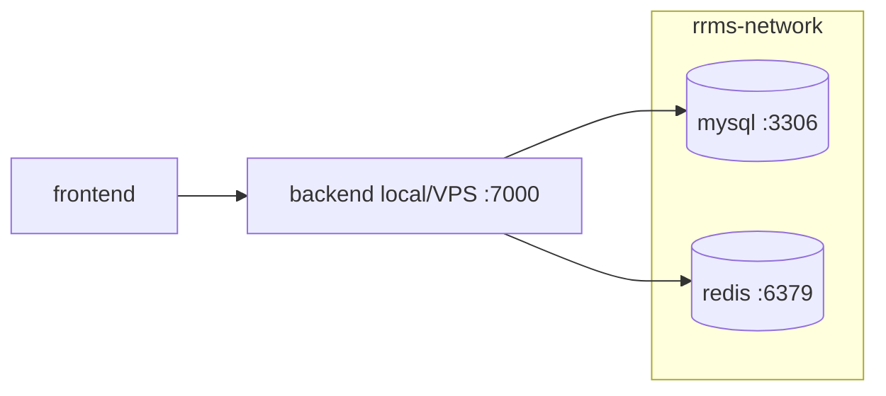

# Docker Compose — RRMS

Hướng dẫn chạy hạ tầng RRMS bằng `docker-compose.yml`.

> **Lưu ý (2026-07):** Elasticsearch, Kibana, Logstash đã **loại bỏ** để tiết kiệm RAM trên VPS hẹp. Tìm kiếm dùng **MySQL/JPA (`LIKE`)**. Chi tiết: [`LOAI_BO_ELASTICSEARCH.md`](./LOAI_BO_ELASTICSEARCH.md).

## Tại sao dùng Docker Compose?

| Không có Compose | Có Compose |
|---|---|
| Chạy thủ công từng container | **1 lệnh** chạy hạ tầng |
| Tự cấu hình network giữa các container | **Tự động kết nối** qua tên service (`mysql`, `redis`) |
| Khó chia sẻ môi trường cho teammate | Commit `.env.example` lên Git, mọi người copy thành `.env` |
| "Máy tôi chạy được, máy anh không" | **Môi trường đồng nhất** trên mọi máy có Docker |

## Kiến trúc



Backend và frontend thường chạy trên host (systemd / `mvn` / `npm`); Docker chỉ cung cấp MySQL + Redis.

## Yêu cầu

- [Docker Desktop](https://www.docker.com/products/docker-desktop/) (Windows/macOS) hoặc Docker Engine + Compose (Linux)
- RAM khuyến nghị: **2 GB+** là đủ cho MySQL + Redis trên VPS nhỏ (không còn Elasticsearch ~400–512 MB)

## Thiết lập nhanh

### 1. Tạo file môi trường

```bash
# Từ thư mục gốc RRMS/
cp .env.example .env
```

Chỉnh `DB_PASSWORD`, `REDIS_PASSWORD`, `JWT_SIGNER` và các API key trong `.env`.  
**Không commit** file `.env` lên Git.

### 2. Chạy hạ tầng (khuyên dùng khi code / deploy VPS)

```bash
docker compose up -d mysql redis
```

### 3. Kiểm tra

| Dịch vụ | URL / lệnh |
|---|---|
| MySQL | `docker exec -it rrms-mysql mysql -uroot -p… -e "SHOW DATABASES;"` |
| Redis | `docker exec -it rrms-redis redis-cli -a … ping` |
| Backend API (host) | http://localhost:7000 |
| Swagger | http://localhost:7000/swagger-ui/index.html |

```bash
docker compose ps
docker compose logs -f mysql
```

## Dev với IDE

Chạy MySQL + Redis trong Docker, backend/frontend trên máy:

```bash
docker compose up -d mysql redis

# Backend (trong server/)
./mvnw -Dmaven.test.skip=true spring-boot:run

# Frontend (trong client/)
npm run dev
```

File `.env` ở thư mục gốc được `spring-dotenv` đọc khi chạy backend local.

## Tên service và kết nối mạng

Trong Docker network `rrms-network`, các container gọi nhau bằng **tên service**:

| Biến môi trường | Giá trị trong Docker | Giá trị khi dev local |
|---|---|---|
| `SPRING_DATASOURCE_URL` | `jdbc:mysql://mysql:3306/rrms...` | `jdbc:mysql://localhost:${MYSQL_PORT}/rrms...` |
| `REDIS_HOST` | `redis` | `localhost` |
| `VITE_APP_API_URL` | `http://localhost:7000` | `http://localhost:7000` |

> **Lưu ý:** Trình duyệt chạy ngoài Docker nên frontend luôn gọi API qua `localhost`/domain, không dùng tên container.

## Lệnh hữu ích

```bash
# Dừng toàn bộ
docker compose down

# Dừng và xóa volume (reset database)
docker compose down -v

# Xem log một service
docker compose logs -f mysql
```

## Xử lý sự cố

**Port bị chiếm:** đổi port trong `.env` (ví dụ `MYSQL_PORT=3307`, `PORT=7001`).

**Backend lỗi kết nối DB:** đợi MySQL healthy (`docker compose ps`), hoặc xem log:

```bash
docker compose logs mysql
```

**Volume Elasticsearch cũ còn sót trên VPS:**

```bash
docker volume ls | grep elasticsearch
docker volume rm rrms_elasticsearch_data   # nếu còn và đã stop container ES
```

## File liên quan

```
RRMS/
├── docker-compose.yml
├── .env.example
├── docs/DOCKER_COMPOSE.md
└── docs/LOAI_BO_ELASTICSEARCH.md
```
